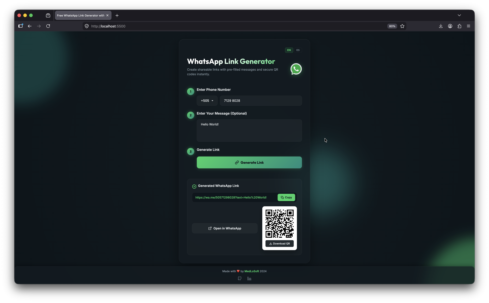

# WhatsApp Link Generator

A modern web application that allows users to generate shareable WhatsApp chat links with optional pre-filled messages and downloadable QR codes.



## Features

- Generate direct WhatsApp chat links using any international phone number.
- Add custom pre-filled messages that automatically appear when the chat is opened.
- Download QR codes linked to generated WhatsApp chats.
- Search and select country dialing codes from a built-in country selector.
- Responsive design optimized for desktop and mobile devices.
- Modern glassmorphism-inspired UI with animated backgrounds.
- Multilingual support (English and Spanish).
- No backend required — runs entirely in the browser.

## Technologies Used

- HTML5
- CSS3
- JavaScript (Vanilla JS)
- Bootstrap 5
- QR Code generation libraries
- Firebase Hosting

## Architecture

The application is built as a static client-side web application.

### Frontend

The interface is developed using:

- Semantic HTML structure
- Custom CSS with modern visual effects:
  - Glassmorphism
  - Animated blurred background blobs
  - Responsive layouts
  - Dark theme design
- Bootstrap components for dropdowns and responsive utilities

### Core Logic

JavaScript handles:

- Phone number validation
- Country code management
- WhatsApp URL generation
- QR code creation
- Clipboard integration
- Dynamic UI state updates

Generated links follow the official WhatsApp format:

```
text https://wa.me/<phone>?text=<encoded_message> 
```

### Internationalization

The project includes separate English and Spanish versions using a simple folder-based structure:

```
/
├── assets/
│   ├── i18n
│   │   ├── en.json
│   │   └── es.json
├── index.html
└── es/
    └── index.html
```

## Deployment

The application is designed to be deployed as a static website and is currently hosted using Firebase Hosting.
